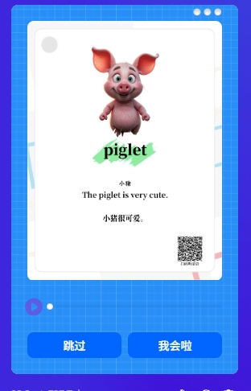

# 项目名称

## 项目介绍

这个项目是一个微信小程序，旨在帮助幼儿学习英语。用户可以通过对话框输入单词，并通过调用大模型的 API 接口获取相关的图片，语音信息。项目的主要功能包括：

- 美观、简洁、易用的用户界面。
- 提供今日已学和昨日已学的单词查询功能。
- 支持用户输入单词并获取相关图片展示。

## 功能特性

1. **对话框界面**：用户可以在对话框中输入单词。
2. **发送按钮**：点击发送按钮后，调用 API 接口获取图片信息。
3. **已学单词查询**：提供今日已学和昨日已学的单词查询功能。

## 项目截图

### 主界面



### 对话框界面


## 安装与使用

1. 克隆项目到本地：

   ```bash
   git clone [https://github.com/xiaowuzicode/flip-card.git]
   ```

2. 在微信开发者工具中打开项目。

3. 配置 API 接口信息。

4. 运行项目并体验功能。

## 贡献

欢迎对本项目的贡献！请提交 pull request 或 issue。

## 许可证

本项目采用 [MIT 许可证](LICENSE)。
